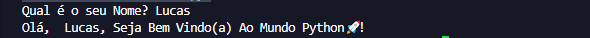
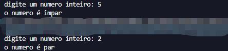
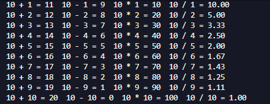
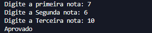
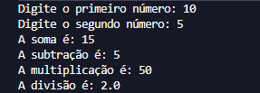
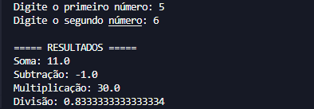

# 🐍 Exercícios Básicos em Python

Repositório criado para praticar lógica de programação e fundamentos da linguagem Python durante os estudos de Análise e Desenvolvimento de Sistemas.

## 📚 Conteúdo do repositório

Os exercícios foram desenvolvidos com foco em prática e aprendizado dos conceitos básicos da programação.

### Exercícios disponíveis

* 👋 Olá Mundo Personalizado
* 🔢 Verificador de Par ou Ímpar
* 📖 Tabuada
* 🎓 Média de Notas
* 🧮 Calculadora Simples
* ⚡ Calculadora usando Funções e Float

---

## 🚀 Tecnologias utilizadas

* Python 3

---

## 🎯 Objetivo

Este repositório faz parte da construção do meu portfólio no GitHub e da minha evolução na programação com Python.

Os exercícios têm como objetivo praticar:

* Variáveis
* Entrada e saída de dados
* Estruturas condicionais
* Laços de repetição
* Funções
* Operações matemáticas
* Organização de código

---

## 📸 Screenshots

### 👋 Olá Mundo Personalizado



---

### 🔢 Verificador de Par ou Ímpar



---

### 📖 Tabuada



---

### 🎓 Média de Notas



---

### 🧮 Calculadora Simples



---

### ⚡ Calculadora usando Funções e Float



---

## ▶️ Como executar os exercícios

1. Clone este repositório
2. Abra a pasta do projeto
3. Execute o arquivo desejado

Exemplo:

```bash
tabuada.py
```

---

## 📁 Estrutura do projeto

```text
python-exercicios-basicos/
│
├── README.md
├── ola_mundo.py
├── par_ou_impar.py
├── tabuada.py
├── media_notas.py
├── calculadora_simples.py
├── calculadora_funcoes.py
│
└── assets/
    ├── ola_mundo.png
    ├── par_ou_impar.png
    ├── tabuada.png
    ├── media_notas.png
    ├── calculadora_simples.png
    └── calculadora_funcoes.png
```

---

## 📌 Observações

Este repositório será atualizado conforme novos exercícios e conhecimentos forem sendo adquiridos.

---

## 👨‍💻 Autor

Lucas Santos
Estudante de Análise e Desenvolvimento de Sistemas
